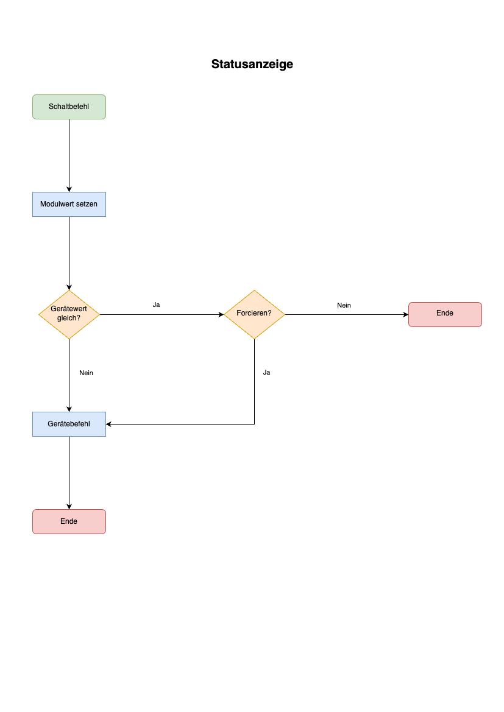

# Statusanzeige  

[](https://homematic-ip.com/de)

Zur Verwendung dieses Moduls als Privatperson, Einrichter oder Integrator wenden Sie sich bitte zunächst an den Autor.  

Für dieses Modul besteht kein Anspruch auf Fehlerfreiheit, Weiterentwicklung, sonstige Unterstützung oder Support.  
Bevor das Modul installiert wird, sollte unbedingt ein Backup von IP-Symcon durchgeführt werden.  
Der Entwickler haftet nicht für eventuell auftretende Datenverluste oder sonstige Schäden.  
Der Nutzer stimmt den o.a. Bedingungen, sowie den Lizenzbedingungen ausdrücklich zu.  


### Inhaltsverzeichnis

1. [Modulbeschreibung](#1-modulbeschreibung)
2. [Voraussetzungen](#2-voraussetzungen)
3. [Schaubild](#3-schaubild)
4. [Auslöser](#4-auslöser)
5. [Schaltlogik](#5-schaltlogik)
6. [Externe Aktion](#6-externe-aktion)
7. [PHP-Befehlsreferenz](#7-php-befehlsreferenz)
   1. [Farbe ändern](#71-farbe-ändern)
   2. [Helligkeit ändern](#72-helligkeit-ändern)
   3. [Modus ändern](#73-modus-ändern)
   4. [Kombinierte Parameter verwenden](#74-kombinierte-parameter-verwenden)
8. [Alternative Ansteuerung](#8-alternative-ansteuerung)

### 1. Modulbeschreibung

Dieses Modul integriert eine [Homematic IP](https://homematic-ip.com/de) Statusanzeige HmIP-BSL, HmIP-MP3P in [IP-Symcon](https://www.symcon.de).  

### 2. Voraussetzungen

- IP-Symcon ab Version 6.1
- HmIP-BSL
- HmIP-MP3P

In der Homematic CCU Zentrale sollte bei den Geräteeinstellungen des jeweiligen Kanals unter **Aktion bei Spannungszufuhr** der **Schaltzustand: Ein** ausgewählt sein.  
Sollten mehrere Homematic Geräte geschaltet werden, so sollte zusätzlich das Modul Ablaufsteuerung genutzt werden.

Der Modus ist nur für die Statusanzeige HmIP-BSL mit Firmware Version mind. 2.0.2 und CCU(3) Firmware Version mind. 3.75.6 verfügbar!
Stand: 29.05.2024

### 3. Schaubild

```
                       +-----------------------------+
                       | Statusanzeige HmIP (Modul)  |
                       |                             |
Auslöser <-------------+ Obere Leuchteinheit         |<------------- externe Aktion
                       |   Farbe                     |
                       |   Helligkeit                |
                       |   Modus                     |
                       |                             |
Auslöser <-------------+ Untere Leuchteinheit        |<------------- externe Aktion
                       |   Farbe                     |
                       |   Helligkeit                |
                       |   Modus                     |
                       +-----------+--+--------------+
                                   |  |
                                   |  |
                                   |  |    +---------------------------+
                                   |  +--->|  Ablaufsteuerung (Modul)  |
                                   |       +--------------+------------+
                                   |                      |
                                   |                      |
                                   v                      |
                       +----------------------+           |
                       |  Statusanzeige (HW)  |<----------+
                       +----------------------+
```

### 4. Auslöser

Das Modul Statusanzeige reagiert auf verschiedene Auslöser.  
Bei mehreren Auslösern kann eine Priorität zugeordnet werden.  
Die zutreffende Bedingung mit der höchsten Priorität wird dann ausgeführt.  

### 5. Schaltlogik

[]()

### 6. Externe Aktion

Das Modul Statusanzeige kann über eine externe Aktion geschaltet werden.  
Nachfolgendes Beispiel setzt die obere Leuchteinheit auf den Farbwert Rot.

```php
SAHMIP_SetColor(12345, 0, 4, true); 
```

### 7. PHP-Befehlsreferenz

#### 7.1 Farbe ändern

```text
boolean SAHMIP_SetColor(integer INSTANCE_ID, integer LIGHT_UNIT, integer COLOR, boolean FORCE_COLOR);
```

Konnte der Befehl erfolgreich ausgeführt werden, liefert er als Ergebnis **TRUE**, andernfalls **FALSE**.

| Parameter     | Wert  | Bezeichnung      | Beschreibung              |
|---------------|-------|------------------|---------------------------|
| `INSTANCE_ID` |       | ID der Instanz   |                           |
|               |       |                  |                           |
| `LIGHT_UNIT`  |       | Leuchteinheit    |                           |
|               | 0     | Upper light unit | Obere Leuchteinheit       |
|               | 1     | Lower light unit | Untere Leuchteinheit      |
|               |       |                  |                           |
| `COLOR`       |       | Farbe            |                           |
|               | 0     | BLACK            | Schwarz (Aus)             |
|               | 1     | BLUE             | Blau                      |
|               | 2     | GREEN            | Grün                      |
|               | 3     | TURQUOISE        | Türkis                    |
|               | 4     | RED              | Rot                       |
|               | 5     | PURPLE           | Violett                   |
|               | 6     | YELLOW           | Gelb                      |
|               | 7     | WHITE            | Weiß                      |
|               |       |                  |                           |
| `FORCE_COLOR` |       |                  |                           |
|               | false | Aus              | Nur bei Änderung schalten |
|               | true  | An               | Schalten erzwingen        |

**Beispiel**:
```php
SAHMIP_SetColor(12345, 1, 2, true);
```

---

#### 7.2 Helligkeit ändern

```text
boolean SAHMIP_SetBrightness(integer INSTANCE_ID, integer LIGHT_UNIT, integer BRIGHTNESS, boolean FORCE_BRIGHTNESS);
```

Konnte der Befehl erfolgreich ausgeführt werden, liefert er als Ergebnis **TRUE**, andernfalls **FALSE**.

| Parameter          | Wert      | Bezeichnung      | Beschreibung              |
|--------------------|-----------|------------------|---------------------------|
| `INSTANCE_ID`      |           | ID der Instanz   |                           |
|                    |           |                  |                           |
| `LIGHT_UNIT`       |           | Leuchteinheit    |                           |
|                    | 0         | Upper light unit | Obere Leuchteinheit       |
|                    | 1         | Lower light unit | Untere Leuchteinheit      |
|                    |           |                  |                           |
| `BRIGHTNESS`       |           | Helligkeit       |                           |
|                    | 0 bis 100 | 0 bis 100%       |                           |
|                    |           |                  |                           |
| `FORCE_BRIGHTNESS` |           |                  |                           |
|                    | false     | Aus              | Nur bei Änderung schalten |
|                    | true      | An               | Schalten erzwingen        |

**Beispiel**:
```php
SAHMIP_SetBrightness(12345, 1, 50, true);
```

---

#### 7.3 Modus ändern

Der Modus ist nur für die Statusanzeige HmIP-BSL mit Firmware Version mind. 2.0.2 und CCU(3) Firmware Version mind. 3.75.6 verfügbar!
Stand: 29.05.2024

```text
boolean SAHMIP_SetMode(integer INSTANCE_ID, integer LIGHT_UNIT, integer MODE, boolean FORCE_MODE);
```

Konnte der Befehl erfolgreich ausgeführt werden, liefert er als Ergebnis **TRUE**, andernfalls **FALSE**.

| Parameter     | Wert  | Bezeichnung      | Beschreibung              |
|---------------|-------|------------------|---------------------------|
| `INSTANCE_ID` |       | ID der Instanz   |                           |
|               |       |                  |                           |
| `LIGHT_UNIT`  |       | Leuchteinheit    |                           |
|               | 0     | Upper light unit | Obere Leuchteinheit       |
|               | 1     | Lower light unit | Untere Leuchteinheit      |
|               |       |                  |                           |
| `MODE`        |       | Modus            |                           |
|               | 0     | OFF              | Beleuchtung aus           |
|               | 1     | ON               | Dauerhaft ein             |
|               | 2     | BLINKING_SLOW    | Langsames Blinken         |
|               | 3     | BLINKING_MIDDLE  | Mittleres Blinken         |
|               | 4     | BLINKING_FAST    | Schnelles Blinken         |
|               | 5     | FLASH_SLOW       | Langsames Blitzen         |
|               | 6     | FLASH_MIDDLE     | Mittleres Blitzen         |
|               | 7     | FLASH_FAST       | Schnelles Blitzen         |
|               | 8     | BILLOW_SLOW      | Langsames Pulsieren       |
|               | 9     | BILLOW_MIDDLE    | Mittleres Pulsieren       |
|               | 10    | BILLOW_FAST      | Schnelles Pulsieren       |
|               | 11    | OLD_VALUE        | Vorheriger Wert           |
|               | 12    | DO_NOT_CARE      | Ohne Berücksichtigung     |
|               |       |                  |                           |
| `FORCE_MODE`  |       |                  |                           |
|               | false | Aus              | Nur bei Änderung schalten |
|               | true  | An               | Schalten erzwingen        |

**Beispiel**:
```php
SAHMIP_SetMode(12345, 1, 2, true);
```

---

#### 7.4 Kombinierte Parameter verwenden

#### Hinweis:
**Für den Farbmodus (COLOR_BEHAVIOUR) und Ansteuerung über einen kombinierten Parameter (COMBINED_PARAMETER) ist eine Geräte-Firmware Version mind. 2.0.2 und CCU(3) Firmware Version mind. 3.75.6 erforderlich!**

```text
boolean SAHMIP_SetCombinedParameters(integer INSTANCE_ID, integer LIGHT_UNIT, integer COLOR, integer BRIGHTNESS, integer MODE, boolean FORCE);
```

Konnte der Befehl erfolgreich ausgeführt werden, liefert er als Ergebnis **TRUE**, andernfalls **FALSE**.

| Parameter     | Wert      | Bezeichnung      | Beschreibung              |
|---------------|-----------|------------------|---------------------------|
| `INSTANCE_ID` |           | ID der Instanz   |                           |
|               |           |                  |                           |
| `LIGHT_UNIT`  |           | Leuchteinheit    |                           |
|               | 0         | Upper light unit | Obere Leuchteinheit       |
|               | 1         | Lower light unit | Untere Leuchteinheit      |
|               |           |                  |                           |
| `COLOR`       |           | Farbe            |                           |
|               | 0         | BLACK            | Schwarz (Aus)             |
|               | 1         | BLUE             | Blau                      |
|               | 2         | GREEN            | Grün                      |
|               | 3         | TURQUOISE        | Türkis                    |
|               | 4         | RED              | Rot                       |
|               | 5         | PURPLE           | Violett                   |
|               | 6         | YELLOW           | Gelb                      |
|               | 7         | WHITE            | Weiß                      |
|               |           |                  |                           |
| `BRIGHTNESS`  |           | Helligkeit       |                           |
|               | 0 bis 100 | 0 bis 100%       |                           |
|               |           |                  |                           |
| `MODE`        |           | Modus            |                           |
|               | 0         | OFF              | Beleuchtung aus           |
|               | 1         | ON               | Dauerhaft ein             |
|               | 2         | BLINKING_SLOW    | Langsames Blinken         |
|               | 3         | BLINKING_MIDDLE  | Mittleres Blinken         |
|               | 4         | BLINKING_FAST    | Schnelles Blinken         |
|               | 5         | FLASH_SLOW       | Langsames Blitzen         |
|               | 6         | FLASH_MIDDLE     | Mittleres Blitzen         |
|               | 7         | FLASH_FAST       | Schnelles Blitzen         |
|               | 8         | BILLOW_SLOW      | Langsames Pulsieren       |
|               | 9         | BILLOW_MIDDLE    | Mittleres Pulsieren       |
|               | 10        | BILLOW_FAST      | Schnelles Pulsieren       |
|               | 11        | OLD_VALUE        | Vorheriger Wert           |
|               | 12        | DO_NOT_CARE      | Ohne Berücksichtigung     |
|               |           |                  |                           |
| `FORCE`       |           |                  |                           |
|               | false     | Aus              | Nur bei Änderung schalten |
|               | true      | An               | Schalten erzwingen        |

**Beispiel**:
```php
SAHMIP_SetCombinedParameters(12345, 1, 2, 50, 1, true);
```

---


### 8 Alternative Ansteuerung

Die Ansteuerung kann alternativ auch direkt an das Gerät erfolgen.

| Gerät     | Kanal | Bezeichnung          |
|-----------|-------|----------------------|
| HmIP-BSL  | 8     | Obere Leuchteinheit  |
| HmIP-BSL  | 12    | Untere Leuchteinheit |
| HmIP-MP3P | 6     | Leuchtring           |

```
boolean HM_WriteValueInteger(integer INSTANCE_ID, 'COLOR', integer COLOR);  
boolean HM_WriteValueFloat(integer INSTANCE_ID, 'LEVEL', float BRIGHTNESS);
boolean HM_WriteValueInteger(integer INSTANCE_ID, 'COLOR_BEHAVIOUR', integer COLOR_BEHAVIOUR);  
```
Konnte der jeweilige Befehl erfolgreich ausgeführt werden, liefert er als Ergebnis **TRUE**, andernfalls **FALSE**.

| Parameter         | Beschreibung            |
|-------------------|-------------------------|
| `INSTANCE_ID`     | ID der Geräte-Instanz   |
| `COLOR`           | Farbe (siehe oben)      |
| `BRIGHTNESS`      | Helligkeit (siehe oben) |
| `COLOR_BEHAVIOUR` | Modus (siehe oben)      |

Die Werte für **COLOR**, **BRIGHTNESS** und **COLOR_BEHAVIOUR** entnehmen Sie bitte der entsprechenden Tabelle.

**Beispiele**:
```php
HM_WriteValueInteger(98765, 'COLOR', 4);  
HM_WriteValueFloat(98765, 'LEVEL', 1);
HM_WriteValueInteger(98765, 'COLOR_BEHAVIOUR', 1);
```

Es kann auch ein kombinierter Befehl zur Ansteuerung genutzt werden.

Farbe: Rot, Helligkeit: 50 %, Farbverhalten: Dauerhaft ein:
```php
HM_WriteValueString(98765, 'COMBINED_PARAMETER', 'C=2,L=50,CB=1');
```

Farbe: Rot, Helligkeit: 50 %, Zeit: 10 Sekunden, Farbverhalten: Mittleres Blinken:
```php
//C = color, L = level, CB = color behaviour, DV = duration value, DU = duration unit, RTV = ramp time value, RTU = ramp time unit
HM_WriteValueString(98765, 'COMBINED_PARAMETER', 'L=50, DV=10, DU=0, RTV=0, RTU=0, C=4, CB=3');
```

---